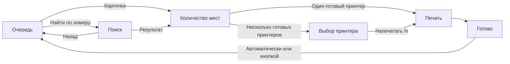

# Puntiro Kiosk Core Flow Design

Дата: 2026-08-07

Статус: согласованный дизайн основного операторского сценария; документ подготовлен к финальному ревью перед техническим планом.

## 1. Назначение документа

Этот документ фиксирует визуальный и UX-дизайн основного сценария Windows-киоска Puntiro: поиск нужной отгрузки, ввод фактического количества мест, выбор принтера при необходимости, печать комплекта этикеток и возвращение к очереди.

Документ развивает:

- продуктовую концепцию `2026-08-07-shipment-label-kiosk-design.md`;
- дизайн платформы `2026-08-07-puntiro-design-system-platform-design.md`;
- брендбук в `brandbook/`;
- существующие токены, компоненты и kiosk patterns пакета `@puntiro/ui`.

Дизайн не начинает реализацию и не расширяет текущий этап до архива, повторной печати, облачной админки или полного набора аварийных экранов. Эти области проектируются следующими самостоятельными потоками.

## 2. Зафиксированные продуктовые решения

1. Киоск используется оператором без персонального входа.
2. Оператор ищет конкретный номер из внешнего документа, а не обрабатывает задания в порядке поступления.
3. Номер отгрузки может содержать произвольные буквы, цифры, префиксы и разделители.
4. Поиск работает по любой части номера и не зависит от физической клавиатуры или сканера.
5. Обычный экран остаётся очередью карточек с постраничной навигацией. Поиск открывается отдельной явной кнопкой.
6. Фактическое количество мест всегда вводит оператор. Допустим диапазон от 1 до 100, обычное значение не превышает 10.
7. При одном совместимом готовом принтере отдельный выбор устройства пропускается.
8. При нескольких совместимых готовых принтерах оператор выбирает устройство перед каждой печатью.
9. Отдельного экрана проверки перед печатью нет. Он дублирует уже видимые данные и замедляет повторяющуюся работу.
10. Печать запускается на последнем экране, где оператор изменяет данные.
11. Значение больше 10 требует компактного подтверждения поверх текущего экрана, но не создаёт отдельный шаг.
12. Неопределённый результат печати не считается успехом, не архивируется автоматически и не вызывает автоматический повтор.

Решение об отсутствии отдельного экрана проверки уточняет шаг 6 основного сценария в `2026-08-07-shipment-label-kiosk-design.md`: номер, количество и принтер остаются видимыми перед запуском, но команда `Напечатать N этикеток` располагается непосредственно на экране количества или выбора принтера.

## 3. Дизайн-направление

Выбрано направление **Operational Calm**.

Его признаки:

- тёплый светлый canvas и спокойные светлые поверхности;
- крупные идентификаторы, счётчики и рабочие значения;
- ясные плоские границы вместо декоративных теней и эффектов;
- orange signal только для выбора, focus и главного действия;
- постоянный визуальный ритм на протяжении длинной смены;
- минимум движения и отсутствие маркетинговой сценографии.

Каноническая визуальная база:

- основной шрифт: Onest;
- номера, счётчики и технические значения: IBM Plex Mono;
- canvas: `#F2F0E8`;
- основная поверхность: `#FFFDF6`;
- основной текст: `#171914`;
- orange signal: `#FF5A1F`.

Точные значения в реализации берутся только из токенов Puntiro. Цветовые литералы выше служат идентификацией утверждённой темы, а не разрешением дублировать значения в компонентах.

## 4. Общий каркас киоска

### 4.1. Базовый viewport

- минимальная утверждённая рабочая область: `1280 x 800`, landscape;
- интерфейс адаптируется только вверх;
- kiosk composition не имеет прокрутки страницы или внутренних рабочих областей;
- критичные действия не зависят от hover, drag, swipe или скрытого жеста;
- нижний и верхний системные inset не должны перекрывать рабочие элементы Windows-приложения.

### 4.2. Верхняя служебная панель

Верхняя панель видна на всех экранах и содержит:

- полностью различимый знак и текст Puntiro;
- состояние соединения;
- имя и состояние текущего принтера либо количество готовых принтеров;
- отдельный текстовый статус, поэтому цвет не является единственным носителем смысла.

Панель не содержит бизнес-навигацию и не превращается в тёмную декоративную полосу.

### 4.3. Навигация верхнего уровня

Нижняя навигация `Отгрузки / Архив` видна только в разделах верхнего уровня:

- очередь отгрузок;
- поиск внутри очереди;
- архив и его поиск на следующем этапе.

Во время обработки выбранной отгрузки нижняя навигация скрыта. Это исключает случайный выход в другой раздел в момент ввода или печати.

### 4.4. Возврат

- поиск возвращает на ту же страницу очереди;
- экран количества возвращает на ту же страницу очереди;
- выбор принтера возвращает на экран количества с сохранённым значением;
- после отправки команды печати возврат и навигация блокируются;
- после успеха киоск возвращается на прежнюю страницу очереди автоматически или по явной кнопке.

## 5. Информационная архитектура happy path

Путь с одним принтером:

`Очередь или поиск -> Количество мест -> Печать -> Готово -> Очередь`

Путь с несколькими принтерами:

`Очередь или поиск -> Количество мест -> Выбор принтера -> Печать -> Готово -> Очередь`

## 6. Экран очереди

### 6.1. Назначение

Очередь является рабочим столом, а не автоматически упорядоченным планом выполнения. Оператор самостоятельно находит номер из внешнего документа и открывает соответствующее задание.

### 6.2. Композиция

Верхняя часть рабочей области содержит:

- заголовок `Отгрузки`;
- количество готовых заданий;
- крупную кнопку `Найти по номеру`.

Центральная часть содержит адаптивную сетку карточек. Нижняя часть содержит две крупные стрелки страниц и индикатор вида `1 / 4`.

### 6.3. Адаптивная вместимость

| Рабочая область | Сетка | Карточек на странице |
| --- | --- | ---: |
| `1280 x 800` | `2 x 3` | 6 |
| от `1600 x 900` | `3 x 3` | 9 |
| от `1920 x 1080` | `4 x 3` | 12 |

При смене размера:

- текст и touch targets не уменьшаются;
- система пересчитывает число страниц;
- текущая либо последняя открытая отгрузка остаётся на видимой странице;
- вертикальная и горизонтальная прокрутка не появляются.

### 6.4. Карточка отгрузки

Вся карточка является одной сенсорной кнопкой. Визуальная иерархия:

1. крупный номер отгрузки;
2. название грузополучателя, максимум две строки;
3. плановая дата отгрузки;
4. короткий статус `Готово`, `Изменено` или `Требует внимания`.

Время поступления не является основным содержимым карточки и не показывается в согласованной композиции. Товарный состав не показывается.

Длинное название грузополучателя сокращается после двух строк. Полное значение повторяется на экране количества, чтобы оператор мог проверить выбранное задание до печати.

Текущий `ShipmentTaskCard` расширяется полем грузополучателя и получает композиционный вариант для очереди. Публичный API не должен заставлять продуктовый экран передавать визуальные классы или стили.

### 6.5. Пагинация

- свайп не используется;
- каждая стрелка имеет touch target не менее 64 px;
- недоступная крайняя стрелка остаётся видимой и получает disabled-state;
- изменение данных не переставляет выбранную оператором карточку неожиданно во время взаимодействия;
- страница восстанавливается после возврата из поиска, отмены ввода и успешной печати.

## 7. Экран поиска

### 7.1. Открытие и закрытие

Поиск открывается только по кнопке `Найти по номеру`. Он не занимает постоянное место в очереди и не конкурирует с карточками.

Кнопка `Назад` закрывает поиск и возвращает оператора на сохранённую страницу очереди.

### 7.2. Композиция

На `1280 x 800` экран делится на две устойчивые области:

- слева результаты;
- справа поле запроса и постоянно видимая экранная клавиатура.

На больших разрешениях область результатов расширяется, а touch targets клавиатуры сохраняют размер.

### 7.3. Поведение поиска

- поиск выполняется по любой части номера;
- сравнение не зависит от регистра букв;
- результат обновляется после каждого введённого символа;
- порядок результатов следует порядку текущей очереди и не создаёт отдельной логики приоритета;
- пустой запрос не копирует всю очередь в результаты, а показывает подсказку для ввода;
- при отсутствии совпадений показывается самостоятельное empty-state с введённой строкой;
- выбор результата сразу открывает экран количества.

На `1280 x 800` показываются до трёх крупных результатов. Если совпадений больше, используются такие же явные стрелки страниц, а не scroll. На больших разрешениях количество строк результатов увеличивается при сохранении минимальной высоты touch target.

Каждый результат повторяет:

- номер отгрузки;
- название грузополучателя;
- плановую дату;
- короткий статус.

### 7.4. Экранная клавиатура

- цифровая раскладка открывается по умолчанию;
- отдельная большая кнопка включает полный режим ввода;
- полный режим содержит явные вкладки `АБВ`, `ABC` и `Символы`;
- слой символов содержит как минимум `-`, `_`, `/`, `.`, `:`, `#`, `+`, скобки и пробел;
- поле всегда показывает текущую строку;
- доступны явные действия `Удалить` и `Очистить`;
- раскладки вместе позволяют ввести любой печатный символ, разрешённый интеграционным контрактом номера;
- физическая клавиатура остаётся поддерживаемым дополнительным способом ввода, но не является требованием.

## 8. Экран количества мест

### 8.1. Контекст

Экран повторяет:

- полный номер отгрузки;
- полное название грузополучателя;
- плановую дату;
- выбранный автоматически принтер, если он один.

Номер остаётся главным визуальным якорем. Название грузополучателя не скрывается и может занимать несколько строк в выделенной области.

### 8.2. Ввод

- диапазон: от 1 до 100;
- исходное состояние не подставляет предположительное количество из товарного состава;
- значение отображается крупным счётчиком вида `5 мест`;
- встроенная цифровая клавиатура содержит цифры `0-9`, `Удалить` и `Очистить`;
- кнопка запуска недоступна при пустом, нулевом или выходящем за диапазон значении;
- изменение данных не требует подтверждения до значения 10 включительно.

Существующий `PlaceCounter` сохраняет числовую семантику и клавиатурную доступность. Для композиции требуется отдельный keypad-паттерн либо режим `PlaceCounter`, который не раскрывает внутренние типы сторонней библиотеки.

### 8.3. Основное действие

При одном готовом совместимом принтере:

`Напечатать 5 этикеток · Zebra ZD421`

Кнопка одновременно сообщает действие, итоговый объём и устройство. Нажатие формирует комплект и запускает печать без промежуточного экрана.

При нескольких готовых совместимых принтерах:

`Выбрать принтер`

Нажатие открывает экран выбора с сохранённым количеством.

### 8.4. Большое количество

Для значения больше 10 нажатие основного действия открывает компактный недеструктивный dialog поверх экрана:

- заголовок: `Напечатать 24 этикетки?`;
- пояснение: значение больше обычного;
- secondary action: `Изменить`;
- primary action: `Да, напечатать 24` либо `Да, выбрать принтер`.

Dialog сохраняет контекст и закрывается без потери введённого значения.

## 9. Экран выбора принтера

Экран показывается только когда готовы несколько совместимых этикеточных принтеров.

Карточка принтера содержит:

- понятное имя устройства;
- расположение, если оно настроено;
- язык `ZPL` или `TSPL`;
- состояние `Готов`, `Занят`, `Нет связи` или `Ошибка`.

Правила:

- готовые устройства доступны как элементы единственной radio-group;
- недоступные устройства видны с причиной, но не выбираются;
- выбранное устройство различимо по границе, marker и accessible state, а не только по цвету;
- основная кнопка недоступна до выбора;
- после выбора кнопка говорит `Напечатать 5 этикеток`;
- отдельной проверки после выбора нет;
- возврат сохраняет введённое количество.

Композиция использует `PrinterPicker`, но размещает его внутри фиксированного no-scroll frame. На `1280 x 800` одна страница содержит до четырёх устройств. Если устройств больше, показываются явные стрелки страниц и индикатор `1 / N`; scroll не появляется. На больших разрешениях сетка может содержать до шести устройств при сохранении touch target не менее 64 px.

## 10. Экран печати

После отправки команды рабочая область становится единым состоянием процесса.

Она показывает:

- номер отгрузки;
- имя принтера и язык;
- текст `Печатается место`;
- крупный счётчик `3 из 5`;
- дискретный progress indicator, соответствующий числу обработанных этикеток;
- пояснение, что повторная команда не будет отправлена автоматически.

Правила:

- действия запуска, возврата и навигации блокируются;
- счётчик является основным содержимым, проценты не используются;
- светлая Operational Calm тема сохраняется;
- движение progress indicator короткое и функциональное;
- компонент `PrintProgress` является основой экрана и получает данные только из подтверждённого состояния print service.

## 11. Экран успеха

Экран подтверждает результат одновременно знаком, текстом и числом:

- `5 этикеток напечатано`;
- номер отгрузки;
- принтер;
- сообщение о переносе задания в архив;
- обратный отсчёт до возврата.

Через 3 секунды киоск возвращается на сохранённую страницу очереди. Большая кнопка `К отгрузкам` позволяет вернуться раньше.

После возврата:

- обработанная карточка отсутствует в активной очереди;
- позиция страницы сохраняется, если страница всё ещё существует;
- если удаление последней карточки уничтожило страницу, открывается последняя существующая страница;
- поиск очищен, если переход к заданию был сделан из поиска.

## 12. Граница ошибки и неизвестного результата

Этот этап не отрисовывает полный recovery flow, но фиксирует обязательную границу поведения:

- `confirmed` или допустимый `accepted` переводит на экран успеха;
- `failed` переводит в отдельное обычное состояние ошибки;
- `unknown` переводит в `UnknownPrintResult`;
- `failed` и `unknown` не архивируют комплект как успешный;
- автоматический повтор запрещён;
- обновление или отмена задания после его открытия и до отправки на принтер блокирует устаревшее действие и требует обновить контекст.

Детальные макеты offline, printer failure, partial print, unknown result и восстановления проектируются следующим этапом до реализации print flow.

## 13. Локализация и текст

- поддерживаются `ru` и `en` через `PuntiroProvider`;
- русский язык используется по умолчанию на MVP-киоске;
- язык меняется общей настройкой или переключателем верхнего уровня, а не внутри каждого экрана;
- композиция не дублируется отдельной веткой для английского;
- кнопка необратимого действия всегда включает глагол и актуальное число;
- слово `этикетка` получает корректную русскую форму;
- длинные RU/EN значения проверяются до Beta;
- emoji не используются как operational icons.

## 14. Доступность и touch

### 14.1. Сенсорное управление

- минимальный touch target: 64 px;
- комфортный touch target: 72 px;
- расстояние между соседними keypad-кнопками исключает случайное двойное нажатие в перчатках;
- primary action занимает всю доступную ширину своей рабочей колонки;
- hover не содержит уникальную информацию.

### 14.2. Клавиатура и screen reader

- все действия доступны с клавиатуры;
- focus order следует визуальному порядку;
- focus boundary соответствует токенам Puntiro и остаётся заметной на canvas и surface;
- карточки заданий имеют полное accessible name, включающее номер и грузополучателя;
- printer cards реализованы как radio-group;
- progress объявляет изменения без создания речевого спама на каждом графическом кадре;
- status badge внутри кнопки не создаёт вложенный live-region;
- success и error объявляются текстом, а не цветом.

### 14.3. Motion

- переходы не требуются для понимания навигации;
- короткая обратная связь на press и смену состояния разрешена;
- reduced motion сводит необязательные длительности к нулю;
- декоративные GSAP-сцены, parallax, бесконечные циклы и cursor-following в киоске не используются.

## 15. Компонентная стратегия

### 15.1. Переиспользуется без изменения концепции

- `PuntiroProvider`;
- `Button` и `IconButton`;
- `Dialog`;
- `StatusBadge` и `InlineMessage`;
- `ProgressIndicator`;
- `PrinterPicker`;
- `PrintProgress`;
- `ConnectivityBanner`;
- `EmptyState`, `LoadingState`, `ErrorState` и `UnknownPrintResult`.

### 15.2. Требует расширения или новой композиции

- `ShipmentTaskCard`: грузополучатель и composition variant без обязательного времени поступления;
- `PlaceCounter`: touch-keypad presentation для прямого числового ввода;
- `ShipmentQueue`: адаптивная no-scroll сетка и постраничная навигация;
- `ShipmentSearch`: partial-match results, цифровая и буквенно-цифровая экранные раскладки;
- `KioskShell`: постоянная health-панель и навигация верхнего уровня;
- `PrintSuccess`: доменная композиция успешного комплекта с автовозвратом.

Новые patterns остаются презентационными: они не выполняют HTTP-запросы, не обращаются к Tauri API, не выбирают принтер автоматически и не управляют маршрутизацией.

## 16. Состояния и данные экранов

Композиции получают явные данные и callbacks. Они не скрывают бизнес-решения внутри UI-пакета.

Минимальные данные карточки и поиска:

- `shipmentId`;
- `shipmentNumber`;
- `consigneeName`;
- `plannedShipAt`;
- `status`.

Минимальные данные экрана количества:

- данные карточки;
- текущее `placeCount`;
- список совместимых принтеров и их состояния;
- автоматически выбранный принтер, когда он единственный;
- состояние создания комплекта и запуска печати.

Название грузополучателя должно поступать из закреплённой редакции задания. Технический план обязан уточнить каноническое поле интеграционного контракта и миграцию, если оно сейчас передаётся только внутри `variables`.

## 17. Проверки перед реализацией

### 17.1. Автоматические

- component и interaction tests для всех новых публичных contracts;
- accessible-name, keyboard и focus проверки;
- no-scroll и overflow проверки на `1280 x 800`, `1600 x 900` и `1920 x 1080`;
- visual baselines RU и EN для ключевых экранов;
- long-number и long-consignee fixtures;
- responsive card-capacity tests: 6, 9 и 12;
- сохранение страницы очереди после поиска, отмены и успеха;
- единственный вызов печати при повторном press;
- отсутствие автоматического retry при `unknown`;
- reduced-motion contract.

### 17.2. Ручные

- Windows viewport и масштабирование 100%, 125% и 150%;
- реальный touch-дисплей `1280 x 800`;
- работа пальцем и в перчатках;
- чтение номера и грузополучателя с рабочей дистанции;
- NVDA на Windows;
- реальный ZPL-принтер;
- реальный TSPL-принтер;
- один и несколько одновременно подключённых принтеров.

Автоматический browser pass не заменяет Windows, physical touch, glove, screen-reader и printer acceptance.

## 18. Следующие дизайн-этапы

После утверждения этого документа:

1. составляется технический план реализации happy path;
2. отдельно проектируются архив, поиск истории, повтор отдельных мест и изменение количества;
3. отдельно проектируются offline, failed, partial и unknown print result;
4. отдельно проектируется облачная админка, привязка киосков и управление интеграционными ключами;
5. реализация начинается только после согласования соответствующего плана.
