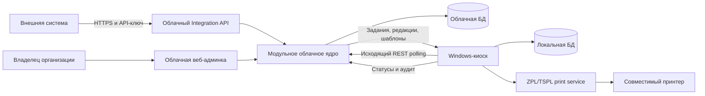
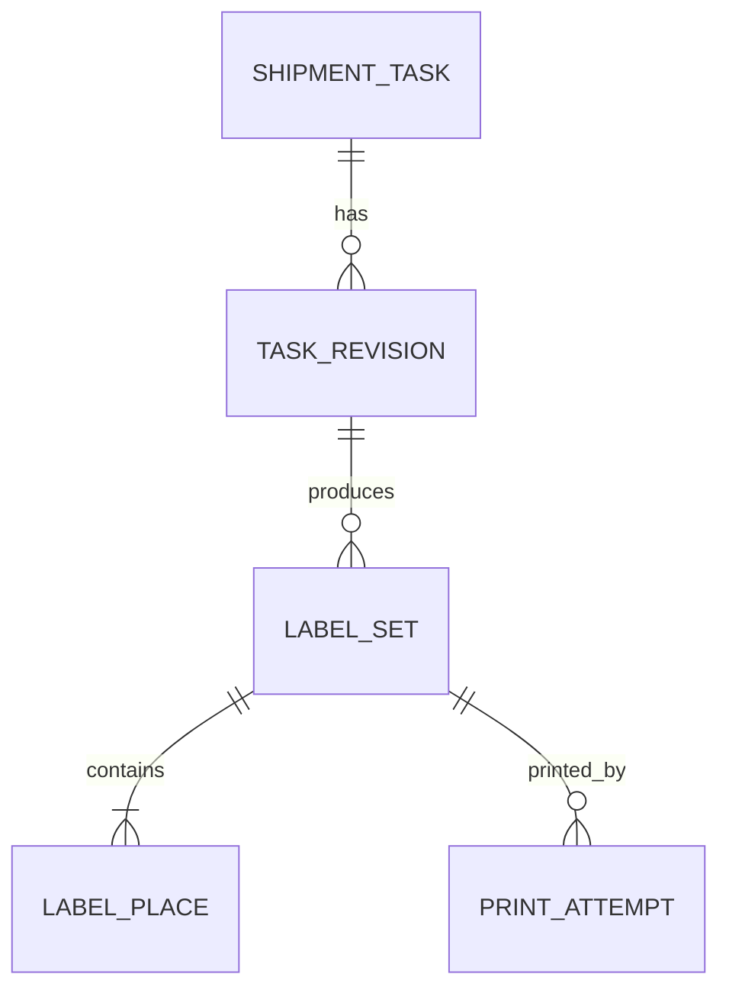

# Концепция системы печати этикеток отгрузки

Дата: 2026-08-07
Статус: согласованная концепция MVP; визуальный дизайн и технический план выполняются отдельными следующими этапами.

## 1. Назначение

Система получает задания на маркировку отгрузок из внешней системы, показывает их на общем сенсорном Windows-киоске и печатает отдельную этикетку для каждого фактического грузового места.

Внешняя система знает поштучный состав отгрузки, но не знает, сколько коробов получится после упаковки. Поэтому оператор выбирает готовую отгрузку и всегда вручную вводит фактическое количество мест. Система создаёт комплект этикеток с нумерацией `1 из N`, уникальным внутренним штрихкодом каждого места и данными отгрузки.

Система не управляет подбором товара и не показывает товарный состав. Её ответственность начинается с уже отобранной отгрузки и заканчивается надёжно зафиксированным результатом маркировки.

## 2. Последовательность проекта

Проект выполняется по четырём этапам:

1. Концепция и основные положения — этот документ.
2. Визуальный и UX-дизайн всех рабочих и аварийных состояний.
3. Согласование финальных макетов и технического плана.
4. Реализация и проверка на реальном оборудовании.

Начало следующего этапа не означает автоматического начала реализации.

## 3. Цели MVP

- Принимать задания через публичный облачный HTTP API.
- Надёжно сохранять задание до ответа об успешном приёме.
- Доставлять задания на привязанный Windows-киоск исходящим соединением.
- Сохранять полученные задания и шаблоны локально для ограниченной офлайн-работы.
- Давать оператору короткий touch-сценарий без входа в систему.
- Печатать параметризованные ZPL- и TSPL-шаблоны на совместимых принтерах.
- Сохранять воспроизводимую историю редакций, комплектов и попыток печати.
- Позволять найти задание, повторить весь комплект или отдельные места и изменить количество мест с созданием новой версии.

## 4. Основные инварианты

1. `external_id` однозначно идентифицирует отгрузку внутри организации и обеспечивает идемпотентность создания.
2. Облако подтверждает приём только после транзакционной записи задания.
3. Киоск показывает задание как готовое только после локальной записи редакции данных и закреплённой версии шаблона.
4. Количество мест всегда задаёт оператор; количество товарных единиц не используется как ожидаемое количество коробов.
5. Каждый комплект закреплён за одной редакцией задания, одной версией шаблона и одним значением `N`.
6. Каждое место имеет неизменные `place_index`, `place_count` и внутренний штрихкод.
7. Повторная печать текущего действительного комплекта воспроизводит прежние места и прежние штрихкоды; отменённые и заменённые комплекты доступны только для просмотра и аудита.
8. Изменение количества мест создаёт полный новый комплект и новые штрихкоды; предыдущий комплект становится заменённым.
9. Данные, которые могли попасть на физическую этикетку, не изменяются и не удаляются задним числом.
10. Неопределённый результат печати никогда не становится успешным автоматически.
11. Облако не печатает и не получает доступ к локальным драйверам или секретам принтеров.
12. Все значимые действия записываются в аудит с привязкой к организации и киоску.

## 5. Границы решения

MVP состоит из трёх подсистем.

### 5.1. Облачное ядро

Модульное приложение с одной основной БД. В коде выделяются самостоятельные модули:

- интеграционный API;
- организации и владелец;
- API-ключи;
- задания и редакции;
- шаблоны и их версии;
- киоски, привязка и отзыв;
- синхронизация устройств;
- аудит;
- веб-админка.

Модули имеют явные интерфейсы, но в MVP не разворачиваются как отдельные микросервисы.

### 5.2. Windows-киоск

Локальное desktop-приложение включает:

- полноэкранный touch-интерфейс;
- агент синхронизации с опросом облака каждые 5 секунд;
- локальную транзакционную БД;
- генератор комплектов и внутренних идентификаторов мест;
- модуль обнаружения принтеров;
- сервис печати с ZPL- и TSPL-адаптерами;
- локальный журнал событий, синхронизируемый после восстановления связи.

Оператор использует общее рабочее место без персонального входа. Действия аудируются по идентификатору киоска.

### 5.3. Принтеры

В MVP поддерживаются два языка печати:

- ZPL;
- TSPL.

Принтер регистрируется с поддерживаемым языком. Zebra, TSC и Bixolon рассматриваются через фактически доступный на конкретной модели нативный язык или совместимый режим эмуляции. Название производителя само по себе не считается доказательством совместимости.

Киоск показывает только подключённые принтеры, совместимые с выбранной версией шаблона. Если такой принтер один, выбор пропускается. Если их несколько, оператор выбирает устройство перед каждой печатью.

Печать документов и отчётов на офисный принтер предусмотрена как будущий отдельный тип вывода, но не реализуется в MVP.

## 6. Общая архитектура

Облако является источником истины для интеграционных заданий, конфигурации и долговременной истории. Киоск является источником истины для локального факта подготовки и отправки конкретной попытки печати до её синхронизации с облаком.

## 7. Организации, доступ и привязка

Модель данных и серверная авторизация изначально изолируют записи по `organization_id`. На старте используется одна организация, один владелец и один киоск.

Предусмотрены два независимых механизма доступа:

1. **API-ключ интеграции.** Владелец создаёт именованный ключ для внешней системы. Секрет показывается один раз, в БД хранится проверочное хеш-значение. Ключ можно отозвать и заменить.
2. **Учётные данные устройства.** Владелец генерирует одноразовый короткоживущий код привязки. Киоск обменивает его на отдельные отзываемые учётные данные устройства. Код одноразовый и не раскрывает API-ключ интеграции.

Все соединения используют HTTPS. API-ключи, коды привязки и учётные данные устройств не попадают в прикладные журналы. Отзыв устройства немедленно запрещает новую синхронизацию, не удаляя локальную и облачную историю.

Сложные роли и персональная авторизация операторов в MVP отсутствуют.

## 8. Интеграционный API

Базовый ресурс API — отгрузка. Конкретные URL могут уточняться в техническом плане, но контракт включает четыре операции:

- создать задание;
- получить текущее состояние по `external_id`;
- создать новую редакцию данных;
- отменить задание.

Минимальные поля входного задания:

- `external_id` — стабильный номер отгрузки или документа продажи;
- `destination_code` — стабильный код целевого киоска или площадки; в MVP существует одно значение;
- `template_code` — стабильный код логического шаблона;
- `document_date` — дата документа;
- `planned_ship_at` — плановая дата или дата-время отгрузки;
- `variables` — значения разрешённых переменных шаблона.

Правила контракта:

- первый корректный запрос создаёт задание и возвращает внутренний идентификатор и состояние;
- идентичный повтор с тем же `external_id` возвращает существующий результат и не создаёт дубль;
- отличающийся повтор операции создания возвращает конфликт и требует явной операции изменения;
- изменение всегда создаёт новую неизменяемую редакцию;
- отмена создаёт аудируемое финальное событие, а не удаляет задание;
- запрос состояния возвращает активную редакцию, жизненный статус и доступный итог печати;
- неизвестный шаблон, запрещённая переменная или отсутствие обязательного значения отклоняются до сохранения задания как принятого.

Обратные вызовы и WebSocket не входят в MVP. Внешняя система получает состояние запросом `GET`.

## 9. Шаблоны

Логический шаблон имеет стабильный `template_code` и последовательность неизменяемых версий. Версия содержит:

- язык ZPL или TSPL;
- исходный текст шаблона;
- физические размеры этикетки и DPI;
- перечень и типы разрешённых входных переменных;
- системные переменные места;
- результат проверки и предпросмотр.

Один логический шаблон может иметь вариант только для одного языка или варианты для обоих. Отсутствие варианта делает принтер с другим языком несовместимым.

Системные переменные MVP:

- `place_index`;
- `place_count`;
- `place_counter_text`, например `3 из 5`;
- `place_barcode`;
- `external_id`;
- `document_date`;
- `planned_ship_at`.

При приёме задания облако закрепляет активную версию логического шаблона. Последующая публикация новой версии не меняет уже принятые задания. Киоск скачивает закреплённую версию вместе с заданием.

Полноценный визуальный редактор шаблонов не входит в MVP.

## 10. Доменная модель

### 10.1. Shipment task

Стабильная сущность отгрузки внутри организации. Содержит `external_id`, назначение и текущий жизненный статус.

### 10.2. Task revision

Неизменяемая редакция входных данных. Содержит даты, переменные и закреплённую версию шаблона. У одного задания может быть несколько редакций, активна ровно одна.

### 10.3. Label set

Комплект этикеток для одной редакции и одного количества мест. Содержит `place_count`, состояние и ссылку на создавший его киоск. Активен не более чем один комплект; предыдущие сохраняются как `superseded`.

### 10.4. Label place

Одно физическое место в комплекте. Содержит индекс от 1 до `place_count` и внутренний непрозрачный идентификатор формата UUIDv7, кодируемый как Code 128. Идентификатор генерируется киоском без обращения к облаку и не меняется при повторной печати.

### 10.5. Print attempt

Отдельная попытка отправки всего комплекта или выбранных мест. Содержит принтер, язык, выбранные места, время, результат, источник подтверждения и безопасное техническое описание ошибки.

## 11. Жизненный цикл

Основной путь задания:

`accepted → ready → printing → printed → archived`

Дополнительные состояния:

- `attention_required` — результат печати неизвестен или после печати пришла новая редакция;
- `cancelled` — задание отменено внешней системой;
- `superseded` — редакция или комплект заменены более новыми.

Правила обновлений:

- новая редакция до печати заменяет активные данные на киоске;
- обновление, полученное после открытия карточки, но до отправки на принтер, блокирует устаревшее подтверждение и требует обновить экран;
- изменение во время печати не меняет уже сформированный комплект;
- новая редакция после печати возвращает задание в активную очередь со статусом «данные изменены — требуется новая печать» и требует полного нового комплекта с новыми штрихкодами;
- прежний комплект становится недействительным и остаётся в неизменяемой истории без возможности повторной печати;
- отмена до печати убирает задание из рабочей очереди;
- отмена после печати помечает уже выпущенные этикетки недействительными и сохраняет факт печати.

## 12. Основной сценарий оператора

1. Киоск показывает очередь крупными карточками, где главным элементом является номер отгрузки. Дополнительно отображаются время поступления и понятный статус.
2. Оператор нажимает на задание.
3. Оператор вводит количество мест крупной цифровой клавиатурой. Разрешён диапазон от 1 до 100. Для нетипично большого значения интерфейс требует явного подтверждения.
4. Киоск формирует предварительный комплект с нумерацией `1 из N` и уникальными Code 128.
5. Если совместимый принтер один, он выбирается автоматически. Если несколько — оператор выбирает один из подключённых готовых устройств.
6. Экран подтверждения крупно показывает номер отгрузки, количество мест, принтер и действие «Напечатать N этикеток».
7. Во время отправки повторный запуск блокируется.
8. После подтверждённого результата задание автоматически переходит в архив, а интерфейс возвращается к очереди.

Подробный товарный состав не показывается ни в очереди, ни в карточке задания.

## 13. Семантика печати и повторов

Результат попытки бывает:

- `confirmed` — адаптер или принтер подтвердил завершение;
- `accepted` — оборудование не поддерживает подтверждение завершения, но системная очередь или транспорт надёжно приняли задание;
- `failed` — отправка определённо не выполнена;
- `unknown` — невозможно доказать полный успех или полный отказ.

При `confirmed` или поддерживаемом fallback `accepted` задание архивируется, а источник подтверждения сохраняется в аудите. При `failed` или `unknown` комплект не архивируется как успешный.

Для `unknown` оператор может:

- повторить весь комплект;
- выбрать конкретные номера мест;
- завершить разбор без автоматической повторной печати.

Повтор использует существующие `Label place`. Изменение количества мест создаёт новый `Label set`, новые места и требует печати полного комплекта. Интерфейс предупреждает, что прежние физические этикетки необходимо изъять.

После аварийного завершения приложения любая незакрытая попытка восстанавливается как `unknown`; автоматическая отправка тех же данных запрещена.

## 14. Синхронизация и офлайн-режим

Киоск выполняет исходящий REST-опрос облака каждые 5 секунд. Получение задания подтверждается устройством только после локальной транзакционной записи редакции и шаблона.

Киоск показывает:

- `online`;
- `offline_allowed` с временем последней синхронизации и обратным отсчётом;
- `offline_blocked`.

По умолчанию новый комплект можно создать и напечатать в течение 30 минут после последней успешной синхронизации. Значение настраивается владельцем организации.

После окончания окна запрещены:

- первая печать задания;
- создание новой версии количества мест;
- печать новой редакции.

Остаются доступны:

- просмотр локального архива;
- повтор уже созданных мест текущего действительного комплекта с прежними штрихкодами.

Ограничение не устраняет риск обновления задания во время офлайна, но делает его явным и ограниченным. После восстановления связи более новая редакция или отмена обрабатываются по общим правилам жизненного цикла.

## 15. Архив и аудит

Архив ищет задания:

- по полному номеру отгрузки;
- по части номера;
- по периоду.

Карточка архивного задания показывает редакции данных, версии комплектов, места, принтеры, результаты и время попыток. Из неё доступны:

- повтор всего текущего действительного комплекта;
- повтор выбранных мест текущего действительного комплекта;
- ввод нового количества мест с созданием полного нового комплекта.

Изменение количества архивного задания не переписывает историю. Задание временно возвращается в рабочий процесс до завершения нового комплекта.

Для отменённых заданий и комплектов со статусом `superseded` действия печати заблокированы. Их данные, предпросмотр и попытки остаются доступны для аудита.

Аудит является добавочным журналом событий. Пользовательский интерфейс показывает понятные формулировки, а подробные технические данные доступны только в админке и не содержат секретов.

## 16. Облачная админка MVP

Один владелец организации может:

- создавать, именовать, отзывать и заменять API-ключи;
- генерировать одноразовые коды привязки;
- видеть имя, состояние, версию приложения и последнюю синхронизацию киоска;
- отзывать киоск;
- загружать, проверять, просматривать и публиковать версии ZPL/TSPL-шаблонов;
- просматривать задания, статусы и аудит;
- настраивать длительность офлайн-окна.

Админка не запускает удалённую печать и не управляет локальными драйверами.

## 17. Обработка ошибок

- Несохранённый облаком запрос не получает успешный HTTP-ответ.
- Неизвестный или отозванный ключ получает отказ без раскрытия существования чужих данных.
- Задание без локального шаблона не показывается как готовое.
- Отключённый, занятый или несовместимый принтер нельзя подтвердить для печати.
- Ошибка подстановки переменных обнаруживается до отправки на принтер.
- Новая редакция перед подтверждением блокирует печать устаревшей карточки.
- Обновление или отмена во время печати не пытаются отозвать уже переданные байты; результат сохраняется и переводится в состояние внимания.
- Сбой приложения не вызывает автоматической повторной печати.
- Невыгруженные локальные события сохраняются и синхронизируются после восстановления связи.

На рабочем экране ошибки показываются крупным полноэкранным или встроенным состоянием с одним очевидным следующим действием. Технические коды не заменяют понятное объяснение.

## 18. Touch-ограничения

Целевая минимальная конфигурация — горизонтальный экран `1280×800`. На более высоких разрешениях интерфейс адаптивно использует пространство, но не уменьшает органы управления.

Обязательные правила:

- нет прокрутки страницы на поддерживаемых разрешениях;
- нет вложенных меню и обязательных скрытых жестов;
- основные цели касания имеют размер не менее 64 px;
- основной текст на рабочем экране имеет размер не менее 18 px;
- номер отгрузки доминирует в визуальной иерархии;
- критические состояния обозначаются одновременно текстом, символом или формой и цветом;
- цифровой ввод не зависит от системной экранной клавиатуры;
- основные сценарии не требуют точного позиционирования пальца;
- интерфейс не показывает оператору товарный состав или административные настройки.

## 19. Нагрузка и хранение

Ожидаемая нагрузка одного киоска — 20–50 заданий в день. Типичный комплект содержит до 10 мест, допустимый диапазон — 1–100.

Для такой нагрузки приоритетны транзакционная надёжность, понятная диагностика и воспроизводимость истории. Брокер сообщений, микросервисы и отдельный локальный сервер склада в MVP не требуются.

Автоматическое удаление архивных заданий в MVP отсутствует. Политика срока хранения может быть добавлена после появления юридических и эксплуатационных требований.

## 20. Состав MVP

В MVP входят:

- мультитенантная основа при одной фактической организации;
- один владелец и один киоск;
- API-ключи и безопасная привязка устройства;
- API создания, чтения состояния, изменения и отмены;
- ZPL/TSPL-шаблоны и их версии;
- local-first очередь и ограниченная офлайн-печать;
- ввод количества, внутренние штрихкоды и печать;
- архив, повтор, изменение количества и аудит;
- обработка обновлений, отмен, ошибок и аварийного восстановления.

В MVP не входят:

- визуальный редактор шаблонов;
- печать документов и отчётов;
- несколько одновременно работающих киосков;
- роли администраторов и вход операторов;
- callback, push и WebSocket;
- передача штрихкодов мест во внешнюю систему;
- универсальный графический формат помимо ZPL/TSPL;
- Linux, macOS, мобильный или браузерный киоск;
- биллинг, аналитика и расширенная отчётность;
- удалённая печать из облака.

## 21. Критерии готовности

Функциональные критерии:

- новое задание появляется на онлайн-киоске не позднее 10 секунд после успешного API-ответа;
- идемпотентный повтор не создаёт дубль;
- изменение и отмена создают корректную неизменяемую историю;
- комплекты на 1, 10 и 100 мест имеют правильные счётчики и уникальные штрихкоды;
- оператор видит только совместимые ZPL/TSPL-принтеры;
- успешная, неуспешная и неопределённая попытки различаются;
- незавершённая попытка безопасно восстанавливается после перезапуска;
- архив находит задание по номеру и периоду;
- повтор сохраняет идентификаторы, изменение количества создаёт новый комплект;
- офлайн-печать прекращается после разрешённого окна;
- устаревшая редакция не может быть незаметно подтверждена перед печатью.

Touch-критерии:

- на `1280×800` отсутствует прокрутка страницы;
- основные действия имеют цели касания от 64 px;
- на Full HD интерфейс использует дополнительное пространство без уменьшения элементов;
- ошибки, офлайн-режим и состояние принтера различимы без опоры только на цвет.

## 22. Проверки

Автоматические проверки:

- модульные тесты доменных переходов и инвариантов;
- интеграционные тесты API и tenant-изоляции;
- контрактные тесты синхронизации и идемпотентности;
- тесты отзыва ключей и устройств;
- тесты восстановления после аварии;
- эталонные проверки сформированных ZPL/TSPL-команд;
- viewport-проверки на `1280×800` и Full HD.

Ручные проверки:

- Windows-установка, запуск и восстановление после перезапуска;
- минимум один реальный ZPL-принтер;
- минимум один реальный TSPL-принтер;
- несколько одновременно подключённых совместимых принтеров;
- отключение, занятость, обрыв и неопределённый результат печати;
- фактическая читаемость счётчика и Code 128;
- работа пальцем на целевом touch-экране.

Автоматические тесты не считаются подтверждением работы на физическом оборудовании.

## 23. Следующий этап: визуальный дизайн

После ревью этого документа начинается отдельный этап UX/UI-дизайна. Он должен включать:

1. карту экранов и переходов;
2. два или три визуальных направления;
3. очередь заданий;
4. ввод количества мест;
5. выбор принтера;
6. подтверждение и ход печати;
7. успех, ошибка и неопределённый результат;
8. онлайн-, ограниченный офлайн- и заблокированный офлайн-режимы;
9. архив, поиск, выбор мест для повтора и изменение количества;
10. обновление и отмену задания;
11. адаптацию `1280×800` и Full HD;
12. комплект согласованных макетов для последующего технического планирования.

Выбор desktop-фреймворка, серверного стека, конкретной СУБД и способа поставки выполняется после согласования визуального дизайна и до начала реализации. Эти решения не должны менять зафиксированные продуктовые инварианты.
