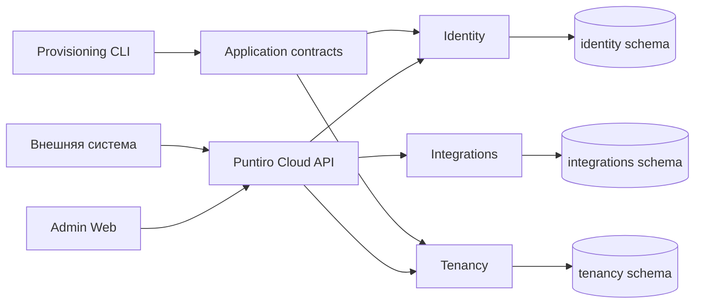

# Puntiro Cloud Identity and Tenancy

Дата: 2026-08-08

Статус: согласованный дизайн этапа 1; ожидает финального письменного review перед implementation plan.

## 1. Назначение

Документ детализирует первый продуктовый этап Puntiro после repository foundation:

- создание первой организации и владельца;
- глобальный аккаунт администратора;
- пароль Argon2id и обязательный TOTP;
- recovery-коды;
- серверные отзываемые сессии;
- membership пользователя в организации;
- долгоживущие integration tokens для внешней системы.

Спецификация развивает:

- `docs/superpowers/specs/2026-08-08-puntiro-technical-architecture-design.md`;
- `docs/superpowers/plans/2026-08-08-puntiro-implementation-roadmap.md`.

Shipment API, шаблоны, устройства, синхронизация и печать относятся к следующим этапам. На этом этапе integration authentication создаёт только готовую границу авторизации для будущего Shipment API.

## 2. Зафиксированные решения

1. Cloud остаётся модульным монолитом ASP.NET Core 10 с PostgreSQL.
2. `Identity`, `Tenancy` и `Integrations` являются отдельными модулями со своими PostgreSQL schemas, `DbContext`, миграциями и application contracts.
3. Email глобально уникален после нормализации. Доступ к организациям задаётся membership, а не дублированием аккаунтов.
4. Первый owner создаётся непубличным provisioning CLI внутри deployment environment.
5. Login принимает email, пароль и TOTP либо recovery-код одним запросом.
6. Admin authentication использует secure cookie и серверную отзываемую сессию.
7. Idle timeout сессии равен 30 минутам, absolute lifetime — 12 часам.
8. Критические административные действия требуют TOTP, подтверждённого не более пяти минут назад.
9. Внешняя система использует один долгоживущий Bearer integration token. OAuth exchange в MVP отсутствует, поскольку источник умеет выполнить только один заранее настроенный HTTP-запрос.
10. Integration token не истекает автоматически, показывается один раз и действует до ручного отзыва. Допускаются два параллельных токена для ручной замены без простоя.
11. Production migrations выполняются deployment-командой до запуска приложения. `MigrateAsync()` при старте production host запрещён.

## 3. Границы модулей



### 3.1. Identity

Владеет:

- глобальными admin accounts;
- password credentials;
- TOTP credentials;
- recovery codes;
- server sessions;
- security events, связанными с аутентификацией.

Identity не определяет, к каким организациям имеет доступ пользователь.

### 3.2. Tenancy

Владеет:

- organizations;
- organization lifecycle;
- memberships;
- ролями membership.

На MVP реализуется роль `owner`. Модель допускает добавление ролей без изменения структуры аккаунта. Identity account не является tenant-записью: tenant authorization появляется только после проверки активной membership.

### 3.3. Integrations

Владеет:

- integration token metadata;
- scopes;
- HMAC verifier секрета;
- revoke state;
- ограниченно обновляемым last-used timestamp;
- security events выпуска и отзыва токенов.

Scopes MVP:

- `shipments.read`;
- `shipments.write`.

### 3.4. Правила взаимодействия

- Общих изменяемых EF entities между модулями нет.
- Модуль не читает и не изменяет чужие таблицы напрямую.
- Межмодульные ссылки передаются как UUIDv7 identifiers через application contracts.
- Membership хранит внешний `user_id`, integration token — внешний `organization_id`; существование и состояние владельца ссылки проверяются use case до commit.
- Побочные межмодульные действия создают durable event/outbox record в транзакции владельца. Обработчики обязаны быть идемпотентными.
- Cloud host отвечает за HTTP, cookies, CSRF, rate limiting и композицию use cases, но не содержит доменных правил модулей.
- Модули публикуют redacted security/audit events через общий audit contract. Полный Audit read model не входит в этот этап.

## 4. Модель данных

### 4.1. Identity schema

`admin_users`:

- `id` UUIDv7;
- исходный email для отображения;
- `normalized_email` с уникальным индексом;
- `status` (`provisioning`, `active`, `suspended`);
- nullable `provisioning_organization_id`, который безопасно связывает незавершённый bootstrap с единственной организацией и очищается после активации;
- timestamps и concurrency token.

Email normalization выполняется одной версионируемой policy: surrounding whitespace удаляется, Unicode приводится к NFC, domain канонизируется через IDNA и lower-case, local part сравнивается invariant case-insensitive. Исходное display value не участвует в уникальности. Slug ограничивается lower-case ASCII `a-z`, `0-9` и одиночными дефисами после trim/collapse.

`password_credentials`:

- `user_id`;
- salt и password hash;
- algorithm identifier;
- сохранённые Argon2id parameters;
- время установки и последнего rehash.

`totp_credentials`:

- `user_id`;
- TOTP secret, зашифрованный ASP.NET Core Data Protection с отдельным purpose;
- `confirmed_at`;
- последний принятый time-step counter для запрета replay;
- дата замены.

`recovery_codes`:

- `id`, `user_id`;
- HMAC verifier высокоэнтропийного кода;
- `used_at`;
- batch identifier и дата выпуска.

`sessions`:

- public session ID;
- HMAC verifier 256-битного session secret;
- `user_id` и выбранный `active_organization_id`;
- `created_at`, `last_seen_at`, `idle_expires_at`, `absolute_expires_at`;
- `second_factor_verified_at`;
- `revoked_at` и revoke reason;
- bounded client metadata без сырого user-agent и персональных данных.

### 4.2. Tenancy schema

`organizations`:

- `id` UUIDv7;
- уникальный нормализованный `slug`;
- display name;
- `status` (`provisioning`, `active`, `suspended`);
- timestamps и concurrency token.

`memberships`:

- `id` UUIDv7;
- `organization_id`;
- внешний `user_id`;
- role (`owner` на MVP);
- `status` (`active`, `revoked`);
- уникальная пара `(organization_id, user_id)`;
- timestamps и concurrency token.

### 4.3. Integrations schema

`integration_tokens`:

- `id` UUIDv7 и уникальный public ID;
- `organization_id`;
- display name;
- HMAC verifier секрета и key version;
- нормализованный набор scopes;
- `created_by_user_id`, `created_at`;
- `last_used_at`;
- `revoked_at`, `revoked_by_user_id`, revoke reason;
- concurrency token.

Raw session secrets, integration tokens, TOTP secrets, recovery codes и passwords в PostgreSQL не сохраняются.

## 5. Provisioning первого владельца

Provisioning реализуется отдельным CLI, например `tools/Puntiro.Provisioning`. Публичного bootstrap HTTP endpoint нет.

CLI запускается внутри deployment environment:

- connection string и cryptographic key configuration поступают из тех же secret sources, что и Cloud;
- organization name, slug и owner email допускаются как arguments;
- пароль читается только из скрытого interactive stdin и не принимается через argument или environment variable;
- TOTP URI/QR и recovery codes показываются только в interactive terminal и не пишутся в structured logs.

Последовательность:

1. Нормализовать slug и email.
2. Создать либо найти organization в состоянии `provisioning`.
3. Создать global account либо безопасно обнаружить конфликт существующего email.
4. Создать новый pending TOTP credential и batch recovery codes.
5. Показать TOTP provisioning URI/QR и recovery codes один раз.
6. Попросить первый TOTP-код и проверить его.
7. Создать owner membership.
8. Активировать organization только после подтверждённого TOTP и membership commit.

Повторный запуск идемпотентен относительно slug и email:

- незавершённый pending TOTP и recovery batch заменяются, чтобы потерянный terminal output не блокировал bootstrap;
- активная организация и owner не изменяются;
- существующий account разрешено продолжить только при совпадении `provisioning_organization_id`; произвольный существующий global account CLI не перепривязывает и не изменяет;
- несовпадающий email, чужая активная membership или неоднозначное состояние завершают команду без автоматического исправления данных;
- не может существовать активная организация без активного owner.

Тот же непубличный CLI предоставляет отдельную команду восстановления `reset-owner-totp`. Она доступна только для active owner, запрашивает пароль и неиспользованный recovery code через скрытый interactive input, показывает новый pending TOTP URI и сохраняет замену только после проверки первого нового TOTP. Успешная операция атомарно инвалидирует прежние TOTP/recovery credentials и отзывает все существующие sessions пользователя. HTTP self-service reset в этап не входит.

## 6. Admin authentication

### 6.1. Password

- Argon2id с индивидуальной случайной солью.
- Начальная policy: memory `19 MiB` (`19456 KiB`), iterations `2`, parallelism `1` — текущий минимальный профиль OWASP для Argon2id.
- Algorithm и параметры сохраняются с credential.
- После успешной проверки более слабая сохранённая policy rehash-ится текущими параметрами.
- Реализация ограничивает размер входного password до дорогостоящего hash, чтобы не допустить memory/CPU abuse.

### 6.2. TOTP и recovery

- RFC 6238 поверх HMAC-SHA-1, шесть цифр и 30-секундный period для совместимости с массовыми authenticator apps. HMAC-SHA-1 используется только в стандартизованном TOTP, а не как password hash или общий integrity primitive.
- Допускается ограниченное временное окно `±1` period.
- Принятый counter сохраняется атомарно; повтор того же кода запрещён.
- Recovery batch содержит десять независимых кодов с криптографической энтропией не менее 128 бит на код.
- Recovery code показывается только при выпуске и после успешной проверки атомарно помечается использованным.
- Ввод recovery code заменяет TOTP только для login/recovery use case и не считается свежим TOTP для выпуска integration token.

### 6.3. Login

`POST /api/admin/auth/login` получает в одном запросе:

- email;
- password;
- TOTP code либо recovery code.

Password-only challenge state не создаётся. Неизвестный email, неверный password, неверный TOTP и использованный recovery code возвращают одинаковую внешнюю ошибку. Внутренние security events различают причину без сохранения credential input.

Rate limiting применяется одновременно по IP и keyed hash нормализованного email. Постоянной блокировки аккаунта из-за удалённых неуспешных запросов нет; используются временные лимиты и нарастающая задержка.

### 6.4. Session

Успешный login создаёт:

- случайный public session ID;
- 256-битный secret;
- HMAC verifier в PostgreSQL;
- cookie `__Host-puntiro_session` со значением `public-id.secret`.

Login с TOTP устанавливает `second_factor_verified_at` в момент входа. Login с recovery code создаёт сессию без свежего step-up, поэтому выпуск integration token потребует обычный TOTP после восстановления authenticator.

Cookie attributes:

- `Secure`;
- `HttpOnly`;
- `SameSite=Strict`;
- `Path=/`;
- без `Domain`.

Сроки:

- idle timeout: 30 минут;
- absolute lifetime: 12 часов;
- серверная запись является источником истины;
- logout и revoke действуют немедленно;
- last-seen persistence может coalesce-иться, но не продлевает absolute lifetime.

При единственной активной membership она становится `active_organization_id`. Будущий выбор между несколькими организациями добавляется отдельным use case; endpoint не принимает произвольный organization ID как доказательство доступа.

State-changing Admin requests требуют antiforgery token в отдельном header и проходят same-origin validation. SameSite cookie не считается единственной CSRF-защитой.

### 6.5. Step-up authentication

`POST /api/admin/auth/step-up` принимает текущий TOTP, запрещает replay и обновляет `second_factor_verified_at` текущей сессии.

Свежий TOTP не старше пяти минут обязателен для:

- выпуска integration token;
- будущей привязки или отзыва kiosk;
- будущей публикации template;
- будущей замены TOTP/recovery batch.

Recovery code не удовлетворяет step-up policy.

## 7. Integration authentication

Формат:

```http
Authorization: Bearer pnt_live_<public-id>.<secret>
```

- public ID позволяет найти metadata без перебора verifier records;
- secret генерируется CSPRNG и имеет не менее 256 бит энтропии;
- verifier вычисляется HMAC отдельным versioned server key;
- сравнение выполняется constant-time;
- raw token возвращается только ответом на create и никогда не может быть прочитан повторно;
- токен действует до ручного revoke;
- организация может иметь не более двух параллельных активных токенов для ручной ротации; создание третьего отклоняется до отзыва одного из действующих;
- authentication principal получает organization ID и scopes только из проверенной записи token;
- перед use case повторно проверяются organization active state и необходимый scope;
- `organizationId` из request body, query или custom header не является источником tenant authorization.

Частое обновление `last_used_at` coalesce-ится, чтобы каждый API request не создавал отдельную запись. Revoke и concurrent metadata changes используют optimistic concurrency.

## 8. HTTP API этапа

### 8.1. Admin auth

```text
POST /api/admin/auth/login
POST /api/admin/auth/logout
GET  /api/admin/auth/session
POST /api/admin/auth/step-up
```

`GET /session` возвращает user metadata, активную organization membership, absolute/idle expiry и antiforgery token, но не возвращает credential metadata, достаточные для атаки.

### 8.2. Integration token management

```text
GET  /api/admin/integration-tokens
POST /api/admin/integration-tokens
POST /api/admin/integration-tokens/{id}/revoke
```

Операции доступны owner активной организации. Create требует свежий step-up TOTP и принимает display name и scopes. Полный bearer token присутствует только в успешном create response. List и revoke возвращают только metadata.

### 8.3. Ошибки и tracing

- Ошибки используют `application/problem+json`.
- Ответ содержит устойчивый machine `code` и `traceId`.
- Authentication error не раскрывает наличие account или правильность отдельного factor.
- Authorization проверяется до вызова use case и до загрузки tenant resource.
- Публичные ответы не содержат stack traces, provider errors, hashes или identifiers чужого tenant.
- Request/response body redaction запрещает попадание auth payload и returned raw token в логи.

## 9. Cryptographic key management

Обязательные независимые key purposes:

- ASP.NET Core Data Protection key ring для TOTP secret encryption и antiforgery;
- session HMAC key;
- integration token HMAC key;
- recovery code HMAC key.

HMAC keys имеют version identifier в verifier record, что позволяет проверить старые записи во время контролируемой ротации. Новые records всегда используют current key. Один key нельзя повторно использовать для разных purposes.

В Timeweb:

- key ring сохраняется на persistent volume;
- key ring защищается deployment secret/certificate;
- HMAC keys поступают из secret environment/storage;
- startup не печатает конфигурационные значения;
- readiness не проходит, если обязательный key source отсутствует или key ring недоступен.

Потеря key ring или HMAC key является incident, а не штатной ротацией. Backup/restore runbook обязан включать проверку восстановления keys отдельно от PostgreSQL.

## 10. Persistence и migrations

- Используются EF Core и Npgsql с точными версиями из central package management.
- Каждый модуль имеет собственный `DbContext`, PostgreSQL schema и migrations assembly.
- Design-time factories получают connection string из явно разрешённого development source, но не содержат default production credentials.
- Production Cloud не вызывает `MigrateAsync()`.
- Deployment сначала запускает проверенный migration bundle или reviewed SQL, затем стартует новый application container.
- Integration tests накатывают migrations на чистую реальную PostgreSQL.
- Expensive cross-module transaction отсутствует в обычных HTTP use cases; durable events и идемпотентные handlers обеспечивают eventual side effects.
- Provisioning activation является оркестрируемым state machine: промежуточная организация не становится доступной обычным use cases.

## 11. Observability и audit

Security/audit event содержит:

- event type и результат;
- actor user ID либо integration token public ID;
- organization ID, если известен;
- UTC timestamp;
- trace ID;
- bounded reason code;
- безопасные network metadata после redaction.

События создаются для login success/failure, logout, session revoke, TOTP/recovery изменения, recovery code use, organization activation, token create и token revoke. Password, TOTP, recovery code, raw bearer token, HMAC verifier, encryption payload и полный email в событие не входят.

Health endpoints:

- `/health/live` — процесс способен обслужить probe;
- `/health/ready` — PostgreSQL доступна, schema/migration совместима, Data Protection key ring и обязательные HMAC keys загружены.

## 12. Dependency choices

Версии повторно подтверждены 2026-08-08 через Context7, официальные package sources и GitHub Advisory Database:

- `Microsoft.EntityFrameworkCore.Design` `10.0.10`;
- `Microsoft.EntityFrameworkCore` `10.0.10`;
- `Npgsql.EntityFrameworkCore.PostgreSQL` `10.0.3`;
- `Microsoft.AspNetCore.OpenApi` `10.0.10`;
- `Microsoft.AspNetCore.Mvc.Testing` `10.0.10`;
- `Konscious.Security.Cryptography.Argon2` `1.3.1`;
- `Microsoft.NET.Test.Sdk` `18.8.1`;
- `xunit.v3` `3.2.2`;
- `xunit.runner.visualstudio` `3.1.5`.

Локальная и CI PostgreSQL фиксируется на текущем безопасном patch release линии 17: `postgres:17.10-bookworm`. EF migrations tool фиксируется в repository tool manifest как `dotnet-ef` `10.0.10`.

План реализации обязан снова сверить версии, если начинается после даты документа или registry metadata изменились. Все package versions фиксируются точно в `Directory.Packages.props`; package references не содержат локальных версий.

TOTP реализуется малым внутренним RFC 6238 service поверх platform cryptography, чтобы не добавлять dependency ради ограниченного алгоритма. Реализация проверяется официальными RFC test vectors. Самописная криптография, собственные hash primitives и не-CSPRNG random запрещены.

## 13. Проверки

### 13.1. Unit

- email и slug normalization;
- organization lifecycle и membership invariants;
- Argon2id policy и rehash decision;
- RFC 6238 test vectors, clock window и replay prevention;
- recovery code one-time behavior;
- session idle/absolute expiry и revoke;
- integration token format, HMAC verification, scopes и constant-time comparison boundary;
- provisioning resume/conflict transitions.
- owner TOTP recovery с password/recovery verification и отзывом прежних sessions;

`TimeProvider` и CSPRNG boundary инъецируются, чтобы тесты не зависели от wall clock и случайных production secrets.

### 13.2. PostgreSQL integration

- каждая migration применяется к чистой PostgreSQL 17;
- уникальность normalized email, organization slug и membership;
- атомарность recovery/TOTP replay protection;
- optimistic concurrency revoke;
- tenant isolation;
- provisioning resume и activation invariants;
- real Npgsql transaction behavior.

SQLite и EF in-memory provider не считаются доказательством PostgreSQL behavior.

### 13.3. HTTP

Через `WebApplicationFactory` и реальную PostgreSQL проверяются:

- login success и неразличимые failures;
- cookie flags, antiforgery и origin policy;
- idle/absolute session expiry;
- logout и server revoke;
- step-up freshness;
- one-time raw token response;
- list/revoke metadata;
- scope и organization derivation;
- rate limits;
- `application/problem+json` и redaction.

CI запускает PostgreSQL service, migrations, unit/integration/HTTP tests и существующий `corepack pnpm check:foundation`. Browser/Windows/hardware acceptance к этому backend-этапу не относится и не объявляется выполненным.

## 14. Документация и repository guidance

В том же change set, что и реализация, создаются или обновляются:

- module README для Identity, Tenancy и Integrations;
- локальный development guide с PostgreSQL и provisioning;
- runbook первого owner;
- runbook TOTP recovery/reset;
- runbook create, parallel replacement и revoke integration token;
- reference переменных окружения с dummy examples;
- OpenAPI auth/token examples и problem codes;
- ADR о global accounts, module-owned schemas и credential storage;
- root либо scoped `AGENTS.md`, если меняются команды, границы или validation gates.

Repository skill создаётся только если provisioning/migration workflow после реализации окажется сложным повторяемым процессом либо критичным редким runbook. Пустой skill заранее не создаётся.

## 15. Не входит в этап

- Shipment API и shipment tables;
- templates;
- kiosk/device binding;
- device credentials;
- Agent sync;
- printer configuration и hardware I/O;
- Admin UI экраны;
- email delivery и self-service password reset;
- OAuth authorization server или Client Credentials;
- multi-organization switch UI;
- operator accounts;
- full Audit read model и audit UI;
- Timeweb production deployment.

## 16. Критерии готовности этапа

Этап завершён, когда:

1. Provisioning CLI создаёт первую active organization только после подтверждённого owner TOTP.
2. Owner входит единым запросом email/password/TOTP либо одноразовым recovery code.
3. Server session соблюдает 30-minute idle и 12-hour absolute expiry, secure cookie и revoke.
4. Step-up TOTP защищает выпуск integration token.
5. Integration token показывается один раз, а затем может быть проверен, ограничен scopes и вручную отозван без хранения raw secret.
6. Tenant context всегда выводится из проверенной session membership или integration token.
7. Реальная PostgreSQL подтверждает migrations, uniqueness, atomicity и isolation.
8. Логи, traces, audit events и errors не содержат credential material.
9. Production host не мигрирует schema при старте.
10. Dependency, documentation, architecture и repository checks проходят вместе.
