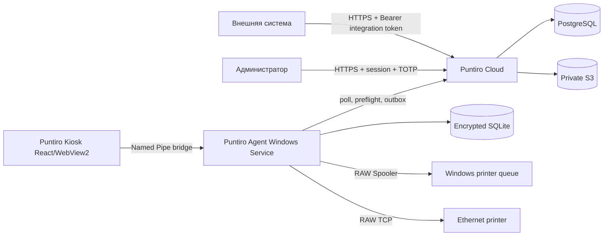

# Техническая архитектура Puntiro

Дата: 2026-08-08  
Статус: согласованный технический дизайн; реализация ещё не начата.

## 1. Назначение

Документ определяет техническую архитектуру Puntiro: облачной админки и API, Windows-киоска, локального агента, синхронизации и печати этикеток через Windows Spooler и Ethernet RAW TCP.

Он развивает ранее согласованные документы:

- `2026-08-07-shipment-label-kiosk-design.md`;
- `2026-08-07-puntiro-design-system-platform-design.md`;
- `2026-08-07-puntiro-kiosk-core-flow-design.md`.

Архитектура рассчитана на MVP с одной организацией и одним киоском, но все облачные данные изолированы по организации, а устройства и принтеры имеют явные назначения.

## 2. Архитектурные решения

1. Облако реализуется как модульный монолит ASP.NET Core 10 с PostgreSQL.
2. Windows-часть состоит из отдельного `.NET Worker Service` и WPF/WebView2-киоска с React-интерфейсом.
3. Существующая дизайн-система `@puntiro/ui` используется и в киоске, и в React-админке.
4. UI не владеет бизнес-состоянием, не открывает SQLite и не обращается к принтерам.
5. Agent владеет локальной операционной БД, синхронизацией, комплектами и фактом отправки данных принтеру.
6. Cloud владеет входными заданиями, редакциями, конфигурацией и долговременным аудитом.
7. Обмен Cloud и Agent использует две идемпотентные очереди событий, а не двустороннее копирование таблиц.
8. Онлайн-печать требует короткого preflight-разрешения Cloud. Офлайн-печать разрешает Agent только внутри настраиваемого grace period.
9. Принтеры подключаются через Windows RAW Spooler либо вручную заданный Ethernet RAW TCP endpoint.
10. Внешняя интеграция использует один долгоживущий Bearer integration token, поскольку целевая система не поддерживает OAuth token exchange.
11. MVP разворачивается в Timeweb Cloud без Kubernetes, брокера сообщений и Redis.
12. Обновление Agent и Kiosk в MVP выполняется вручную единым подписанным MSI.

## 3. Цели и ограничения

### 3.1. Цели

- Надёжно принять задание и не подтверждать приём до commit в PostgreSQL.
- Доставить задание киоску не позднее следующего успешного цикла синхронизации.
- Продолжить работу по уже синхронизированным данным во время краткого сбоя связи.
- Не печатать, если локальное намерение и точный payload не сохранены транзакционно.
- Различать доказанный отказ, принятие транспорта и неопределённый результат.
- Восстановить состояние после перезапуска UI, Agent или сети без автоматической повторной печати.
- Сохранить воспроизводимую историю редакций, комплектов, мест и попыток.

### 3.2. Не входит в MVP

- Kubernetes и микросервисное развёртывание;
- брокер Kafka/RabbitMQ;
- Redis как обязательная зависимость;
- WebSocket для доставки заданий;
- автоматическое обнаружение Ethernet-принтеров;
- автоматическое обновление Windows-приложения;
- OAuth Client Credentials для внешних систем;
- персональная авторизация операторов;
- офисная печать документов и отчётов;
- визуальный редактор ZPL/TSPL;
- несколько одновременно работающих киосков на одной общей офлайн-очереди.

Последнее ограничение необходимо для однозначного поведения офлайн. В MVP одно `destination_code` имеет один активный рабочий киоск. Поддержка конкурентной офлайн-печати общей очереди несколькими киосками требует отдельного дизайна claim/lease и не подразумевается текущей tenant-моделью.

## 4. Технологический стек

### 4.1. Cloud

- .NET 10 LTS;
- ASP.NET Core;
- Entity Framework Core и Npgsql;
- PostgreSQL 17;
- OpenAPI 3.1;
- OpenTelemetry;
- React + Vite для админки;
- существующие `@puntiro/ui` и `@puntiro/tokens`.

### 4.2. Windows

- .NET 10 LTS Worker Service;
- WPF как минимальная нативная оболочка;
- Microsoft Edge WebView2;
- React + `@puntiro/ui` внутри WebView2;
- SQLite с SQLCipher;
- Windows DPAPI для защиты ключа БД и device credential;
- Named Pipes для локального IPC;
- Windows Print Spooler RAW API и `System.Net.Sockets` для RAW TCP.

### 4.3. Репозиторий

MVP остаётся монорепозиторием, чтобы изменения домена, OpenAPI, IPC и UI проходили одним review:

```text
apps/
  admin/                 React admin
  storybook/             design system platform
  kiosk-web/             React kiosk application
  kiosk-shell/           WPF + WebView2 host
  agent/                 Windows Worker Service
  cloud/                 ASP.NET Core host
src/
  Puntiro.Modules.*      cloud modules
  Puntiro.Agent.*        local agent modules
  Puntiro.Contracts.*    IPC and shared protocol contracts
packages/
  ui/
  tokens/
  api-client/            generated TypeScript OpenAPI client
infra/
  timeweb/
  compose/
```

TypeScript и C# не импортируют доменные модели друг друга. Межъязыковые границы описываются OpenAPI и версионируемым IPC-контрактом.

### 4.4. Политика зависимостей

Проект использует последние стабильные и поддерживаемые версии, совместимые с выбранной LTS-платформой. `latest` не является плавающим диапазоном в production: после выбора версия фиксируется точно и обновляется отдельным проверяемым изменением.

Перед добавлением или обновлением framework, SDK, NuGet- или npm-пакета исполнитель обязан:

1. разрешить официальный library identifier и прочитать актуальную документацию через Context7;
2. проверить текущую stable/LTS-линию и совместимость с целевым runtime;
3. проверить официальные security advisories и vulnerability database package registry;
4. прочитать release notes и breaking changes;
5. выбрать последнюю безопасную совместимую версию, а не механически наибольший номер;
6. зафиксировать причину выбора в PR или dependency note, если выбран не последний stable release.

Для .NET используется Central Package Management и точные версии в `Directory.Packages.props`. Для pnpm сохраняются `saveExact`, frozen lockfile и точная версия package manager. Pre-release, nightly и неподдерживаемые версии запрещены без отдельного ADR.

CI проверяет прямые и транзитивные уязвимости NuGet/npm, license policy, lockfile reproducibility и формирует SBOM. Автоматический dependency bot может открывать обновления, но merge разрешён только после CI; major updates проходят явное архитектурное review.

Context7 является обязательным источником актуальной документации библиотек, но не заменяет security advisory и проверку реального lockfile. Например, Context7 подтверждает соответствие EF Core 10 платформе .NET 10 и рекомендует применять production migrations отдельным bundle/SQL script, а не `MigrateAsync()` при старте приложения. Этот подход закреплён в разделе развёртывания.

### 4.5. Documentation as code

Полезная документация создаётся вместе с первым рабочим контуром и обновляется в том же change set, что и поведение. Документ не должен описывать функцию как готовую до появления проверяемой реализации.

Обязательные артефакты:

- root `README.md` с назначением, локальным запуском и картой документации;
- module README: ответственность, public contracts, owned data, зависимости и failure modes;
- OpenAPI с рабочими примерами запросов и `application/problem+json`;
- IPC protocol reference и compatibility policy;
- ADR для решений, которые трудно и дорого отменить;
- runbooks: deploy/rollback, backup/restore, привязка киоска, регистрация принтера, `unknown` print result и revoked device;
- troubleshooting без токенов, payloads и персональных данных;
- release checklist с отдельными automated и physical acceptance gates.

CI проверяет внутренние ссылки, формат ключевых документов, актуальность generated API reference и отсутствие незаполненных `TODO/TBD` в release documentation.

### 4.6. `AGENTS.md`

Корневой `AGENTS.md` создаётся первым изменением repository foundation до production-кода. Он является обязательным контрактом для агентов и содержит:

- назначение продукта и архитектурные инварианты;
- карту каталогов и владельцев данных;
- разрешённые зависимости между модулями;
- точные команды bootstrap, build, test, lint, migrations и package audit;
- правило Context7 и dependency policy;
- требование обновлять документацию вместе с поведением;
- правила работы с generated files, migrations и exact payload fixtures;
- запрет прямой печати из UI и обхода Agent;
- no-scroll/touch требования киоска;
- разделение browser/CI acceptance и Windows/hardware acceptance;
- правила секретов, redaction и безопасных логов;
- правила работы с dirty worktree и недеструктивного Git.

При появлении действительно отличающихся правил допускаются вложенные `AGENTS.md` в `apps/agent`, `apps/cloud`, `apps/kiosk-web` или `infra`. Локальный файл содержит только отклонения и дополнения, не копирует корневой документ. Изменение команды, структуры или gate требует обновить соответствующий `AGENTS.md` в том же commit/PR.

### 4.7. Репозиторные skills

Репозиторный skill создаётся, когда повторяющаяся процедура:

- специфична для Puntiro;
- состоит из нескольких точных шагов или проверок;
- плохо помещается в короткое правило `AGENTS.md`;
- уже встречалась минимум дважды либо является критичным редким runbook, где ошибка опасна.

Skills хранятся в `.agents/skills/<skill-name>/SKILL.md`; необходимые scripts, fixtures и templates располагаются рядом. Skill не содержит секретов, не дублирует общую документацию и имеет проверяемый пример использования.

Вероятные кандидаты после появления реальных процедур:

- `puntiro-printer-hardware-acceptance`;
- `puntiro-label-template-conformance`;
- `puntiro-timeweb-release-and-rollback`;
- `puntiro-offline-recovery-drill`.

Создавать пустые skills заранее запрещено. Решение принимается по фактической повторяемости или риску процесса.

## 5. Общая схема



### 5.1. Владение состоянием

- Cloud владеет намерением: заданием, текущей редакцией, отменой, шаблоном и конфигурацией.
- Agent владеет локальным физическим фактом: созданным комплектом, frozen payload и попыткой отправки.
- UI владеет только временным состоянием представления.

## 6. Cloud как модульный монолит

Один ASP.NET Core host содержит следующие модули.

### 6.1. Identity

Пользователи админки, пароль, TOTP, recovery codes, серверные сессии и security events.

### 6.2. Tenancy

Организации, площадки, владельцы и tenant policy. Все tenant-записи содержат `organization_id`. Авторизация проверяет tenant до выполнения use case, а не только фильтрует результат запроса.

### 6.3. Integrations

Integration tokens, scopes, rate limits, проверка входных схем и внешний HTTP boundary.

### 6.4. Shipments

`ShipmentTask`, immutable `ShipmentRevision`, текущая редакция, изменение и отмена.

### 6.5. Templates

Логический `template_code`, immutable ZPL/TSPL versions, разрешённые переменные, проверка и публикация.

### 6.6. Fleet

Киоски, одноразовая привязка, device credentials, версии приложений, логические принтеры, connection profiles, assignments и health projection.

### 6.7. Device Sync

Упорядоченный change feed, cursor, upstream inbox deduplication, heartbeat и print preflight authorization.

### 6.8. Printing Ledger

Комплекты, места, frozen payloads, попытки, результаты и reconciliation локальных событий.

### 6.9. Audit

Append-only события значимых административных, интеграционных и операционных действий. Read model аудита допускает перестроение из журнала.

### 6.10. Admin API и Jobs

Admin API оркестрирует административные use cases, но не владеет доменными таблицами. Встроенные фоновые jobs отправляют transactional outbox, контролируют retention, heartbeat и backup-status.

### 6.11. Правила модулей

- Модуль владеет собственными таблицами или PostgreSQL schema.
- Прямое чтение чужих таблиц запрещено.
- Синхронная связь идёт через application interface.
- Побочные межмодульные действия публикуются через transactional outbox после commit.
- Ошибка обработчика не откатывает уже подтверждённую входную транзакцию; событие повторяется безопасно.

## 7. Windows Agent и Kiosk

### 7.1. Puntiro Agent

Agent запускается Windows Service под отдельным service SID и содержит:

- `DeviceIdentity`;
- `SyncEngine`;
- `ShipmentProjection`;
- `TemplateRenderer`;
- `PrintCoordinator`;
- `PrinterInventory` и `PrinterHealth`;
- `WindowsSpoolerTransport`;
- `TcpRawTransport`;
- `SQLiteStore`;
- `Diagnostics`.

Каталог данных находится в `%ProgramData%\Puntiro` и доступен только service SID и администраторам системы.

### 7.2. Puntiro Kiosk

Kiosk запускается под выделенным непривилегированным Windows-пользователем. WPF отвечает только за окно, WebView2, автозапуск, системные события и bridge. Вся touch-композиция остаётся React-приложением.

Kiosk не может:

- открыть SQLite;
- получить device credential;
- вызвать Spooler или TCP transport;
- изменить локальный cursor;
- самостоятельно завершить print attempt.

### 7.3. IPC

WPF host общается с Agent через Named Pipe. Pipe защищён ACL для service SID и kiosk-пользователя. WebView2 не получает прямого доступа к pipe: сообщения проходят через закрытый allowlist native bridge.

При подключении выполняется handshake:

- protocol version;
- версия Agent и Kiosk;
- capabilities;
- идентификатор текущей сессии событий.

UI сначала получает полный snapshot, затем подписывается на event stream. После reconnect snapshot запрашивается заново. Каждая изменяющая команда содержит `operation_id` и ожидаемую версию сущности. Повтор команды с тем же `operation_id` возвращает прежний результат.

MSI обновляет Agent и Kiosk вместе. Установщик проверяет состояние Agent и прекращает установку, если активна попытка печати.

## 8. Модель данных

### 8.1. Cloud/PostgreSQL

Основные сущности:

- `organizations`;
- `admin_users`, `sessions`, `totp_credentials`;
- `integration_tokens`;
- `kiosks`, `device_credentials`, `activation_codes`;
- `printers`, `printer_connection_profiles`, `kiosk_printer_assignments`;
- `shipment_tasks`, `shipment_revisions`;
- `logical_templates`, `template_versions`;
- `label_sets`, `label_places`, `label_payloads`;
- `print_attempts`;
- `device_change_feed`, `device_event_inbox`;
- `audit_events`.

### 8.2. Agent/SQLite

Основные таблицы:

- `sync_state`;
- `task_projection`;
- `revision_snapshots`;
- `template_snapshots`;
- `printer_projection`;
- `label_sets`, `label_places`, `label_payloads`;
- `print_attempts`;
- `agent_outbox`;
- `operation_locks`;
- `diagnostic_log`;
- `schema_metadata`.

UUIDv7 используется для локально и облачно создаваемых business identifiers. Редакция задания имеет монотонный номер внутри `ShipmentTask`. Временные значения хранятся в UTC; `document_date` хранится как дата без времени, `planned_ship_at` — как значение со смещением.

## 9. Внешний Integration API

### 9.1. Авторизация

Целевая внешняя система способна выполнить только один бизнес-запрос с заранее заданными заголовками. Поэтому MVP использует долгоживущий Bearer integration token, а не OAuth Client Credentials.

```http
Authorization: Bearer pnt_live_<public-id>.<secret>
```

Токен:

- показывается один раз;
- действует до ручного отзыва;
- привязан к `organization_id` и scopes;
- хранится как публичный идентификатор и HMAC-проверочное значение секрета;
- может существовать параллельно со вторым токеном для ручной ротации;
- не попадает в логи.

Scopes MVP: `shipments.read` и `shipments.write`.

### 9.2. Операции

```text
POST /api/v1/shipment-tasks
POST /api/v1/shipment-tasks/revise
POST /api/v1/shipment-tasks/cancel
GET  /api/v1/shipment-tasks?external_id=...
POST /api/v1/shipment-tasks/status
```

`POST /status` является эквивалентом GET для систем, которым неудобно безопасно кодировать произвольный номер в query string.

Минимальная входная модель создания:

- `external_id`;
- `destination_code`;
- `template_code`;
- `consignee_name`;
- `document_date`;
- `planned_ship_at`;
- `variables`.

### 9.3. Идемпотентность

- Идентичный повтор create возвращает существующий результат.
- Create с тем же `external_id` и другим fingerprint возвращает `409`.
- Идентичный revise не создаёт новую редакцию.
- Повтор cancel возвращает текущее отменённое состояние.
- Дополнительный `Idempotency-Key` допускается, но корректность не зависит от его наличия.

Ответ об успешном приёме отправляется только после PostgreSQL commit. Ошибки используют `application/problem+json`; каждый ответ содержит `X-Request-Id`. Неизвестные поля отклоняются. OpenAPI публикуется с примерами RU/EN-независимых машинных кодов ошибок.

## 10. Синхронизация и offline grace

### 10.1. Cloud → Agent

Cloud формирует `device_change_feed`, упорядоченный монотонным cursor для конкретного киоска. Agent каждые пять секунд запрашивает следующую порцию изменений.

Agent в одной SQLite-транзакции:

1. проверяет совместимость события;
2. применяет projection changes;
3. сохраняет cursor;
4. выполняет commit.

При ошибке cursor не продвигается. Повтор того же batch безопасен.

### 10.2. Agent → Cloud

Локальные факты записываются в `agent_outbox` в той же транзакции, что и бизнес-изменение. Каждое событие имеет UUIDv7 `event_id`. Cloud хранит inbox и возвращает прежний результат при повторе `event_id`.

### 10.3. Онлайн-preflight

Перед созданием нового комплекта Agent запрашивает короткое одноразовое print authorization. Cloud атомарно проверяет:

- device active;
- task active;
- revision current;
- destination matches;
- отсутствует конфликтующая активная авторизация.

Разрешение связано с task, revision, kiosk и `operation_id`, действует 30 секунд и не является доказательством печати.

### 10.4. Офлайн-режим

Состояния:

```text
online → offline_allowed → offline_blocked
```

По умолчанию новый комплект можно создать и напечатать в течение 30 минут после последней успешной синхронизации. Политика настраивается администратором, включая значения 15–30 минут.

Offline-комплект помечается возрастом последней синхронизации. После истечения grace period просмотр разрешён, создание комплектов и печать запрещены. Успешная полная синхронизация снимает блокировку.

Agent использует monotonic elapsed time, пока процесс жив. После перезапуска он сверяет сохранённое server UTC и локальное UTC. Откат часов или неоднозначность блокируют офлайн-печать до синхронизации.

Ответ Cloud `401/403` переводит Agent в `revoked` немедленно и не запускает новый grace period.

## 11. Принтеры

### 11.1. Модель

- `Printer` — логическое устройство: имя, площадка, язык и enabled-state.
- `ConnectionProfile` — Windows Queue либо Ethernet endpoint.
- `KioskPrinterAssignment` — разрешение использовать устройство на киоске.

Windows Queue всегда привязана к одному киоску. Ethernet endpoint может назначаться нескольким киоскам одной площадки.

### 11.2. Конфигурация

Agent публикует в Cloud инвентарь установленных machine-wide Windows queues: имя, driver, port и системный статус. Администратор вручную выбирает очередь и назначает ZPL/TSPL.

Ethernet-профиль задаётся вручную: display name, hostname/IP, port, язык и location. Автоматического сетевого discovery нет.

### 11.3. Health

Agent нормализует состояния:

- `ready`;
- `busy`;
- `offline`;
- `error`;
- `unknown`.

TCP probe проверяет DNS и возможность соединения, но не отправляет этикетку. Проверочная печать — отдельная явная административная команда и audit event. Устаревший heartbeat не выдаётся за `ready`.

Если готов один совместимый принтер, UI пропускает выбор. При нескольких готовых устройствах оператор выбирает каждый раз. При нуле готовых устройств печать блокируется.

## 12. Шаблоны и payload

Template version immutable и содержит язык, DPI, физический размер, typed variable schema и проверенный template AST. Произвольный исполняемый код и общий scripting engine запрещены.

Renderer:

- принимает только declared variables;
- выполняет языково-зависимое escaping;
- не подставляет входные строки как необработанные ZPL/TSPL commands;
- детерминирован при одинаковых template version и input snapshot;
- формирует отдельный payload каждого места;
- сохраняет точные bytes и SHA-256 до printer I/O.

Повтор текущего комплекта использует сохранённые bytes и прежние barcodes. Изменение количества мест создаёт новый label set, новые UUIDv7 barcodes и новые payloads; прежний комплект становится `superseded`.

## 13. Конечный автомат печати

Перед первым обращением к транспорту Agent в одной SQLite-транзакции сохраняет:

- `LabelSet`;
- все `LabelPlace`;
- frozen payloads и hashes;
- `PrintAttempt`;
- operation lock;
- outbox event.

После commit `PrintCoordinator` передаёт payload выбранному transport adapter.

Нормализованные результаты:

- `confirmed` — устройство или двусторонний протокол подтвердили завершение;
- `accepted` — Spooler принял job либо TCP полностью принял payload;
- `failed` — доказано, что отправка не была принята;
- `unknown` — невозможно доказать полный успех или полный отказ.

`confirmed` и `accepted` завершают задание штатно и переводят его в архив. `failed` разрешает только явный повтор. `unknown` переводит задание в `attention_required`; автоматический повтор и автоматическая архивация запрещены.

Закрытие или перезапуск UI не меняет PrintAttempt. После восстановления UI получает состояние от Agent.

## 14. Безопасность

### 14.1. Администратор

- email + password;
- Argon2id с индивидуальной солью;
- обязательный TOTP, секрет которого шифруется серверным data-protection key;
- hashed recovery codes;
- серверные отзываемые сессии;
- повторный второй фактор для выпуска токена, привязки/отзыва киоска и публикации шаблона.

### 14.2. Киоск

Одноразовый код привязки действует десять минут. После активации Agent получает отдельную отзываемую device credential. Access token действует 15 минут. Rotating refresh token имеет 30-дневное sliding-окно и 90-дневный абсолютный срок; повторное использование старого refresh token отзывает credential family. В Cloud refresh token хранится только как проверочное значение.

Device secrets и SQLCipher key защищаются Windows DPAPI в machine scope. mTLS в MVP не требуется.

### 14.3. Локальная граница

- отдельный service SID;
- непривилегированный kiosk-user;
- Named Pipe ACL;
- закрытый WebView2 bridge;
- отсутствие localhost HTTP listener;
- подписанный MSI;
- bounded и redacted logs.

### 14.4. Cloud

- TLS only;
- secrets из environment/secret storage, не из repository;
- tenant authorization на каждом use case;
- rate limits для integration и identity endpoints;
- CSP и secure cookies для admin;
- audit без токенов и label payloads.

## 15. Политика сбоев

| Сбой | Решение |
| --- | --- |
| Cloud недоступен | Переход в grace period, countdown в UI, outbox сохраняется |
| Grace истёк | Новые комплекты и печать блокируются |
| Device revoked | Немедленный `offline_blocked`, новая привязка обязательна |
| Revision устарела | Preflight отклоняет операцию до создания комплекта |
| SQLite/disk failure | Fail closed; memory-only печать запрещена |
| Printer unavailable до I/O | `failed`, явный повтор или другой принтер |
| Разрыв после начала I/O | `unknown`, никакого auto-retry |
| Несовместимое sync event | Cursor не меняется, требуется совместимый MSI |
| UI crash | Agent продолжает владеть попыткой; UI восстанавливается snapshot-ом |

Сетевые повторы используют exponential backoff с jitter. Восстановление сети или printer health никогда самостоятельно не запускает отложенную печать.

## 16. Timeweb Cloud

### 16.1. MVP topology

- одна Timeweb Cloud Server VM;
- Docker Compose;
- Caddy или Nginx;
- `puntiro-api` container;
- immutable admin static artifact;
- отдельный migration job;
- PostgreSQL 17 DBaaS;
- private S3 bucket.

Публично доступны только `80/443`. PostgreSQL не получает public IP, если выбранная сеть Timeweb допускает private connectivity.

### 16.2. Домены

- `admin.<domain>` — React admin;
- `api.<domain>` — integration, admin и device API.

CORS разрешает только production admin origin. Device и integration API не зависят от browser cookies.

### 16.3. Backup

- автоматический физический backup DBaaS;
- ежедневный независимый encrypted logical dump в S3;
- versioning для backup и release artifacts;
- quarterly restore drill с зафиксированным результатом.

### 16.4. Deployment

CI собирает versioned containers и подписанный MSI. Cloud deployment сначала выполняет проверенный EF Core migration bundle или reviewed SQL script, затем заменяет application container и проверяет readiness. Runtime-вызов `MigrateAsync()` в production запрещён. Destructive schema changes выполняются отдельным последующим release по expand/contract pattern.

## 17. Наблюдаемость

Cloud использует structured logs, metrics и distributed traces через OpenTelemetry. Основные correlation identifiers:

```text
request_id → operation_id → event_id → print_attempt_id
```

Обязательные сигналы:

- device heartbeat age;
- текущий sync cursor и lag;
- outbox depth и oldest event age;
- offline state и оставшееся grace time;
- print attempts по outcome и transport;
- unknown attempt alert;
- printer readiness и last probe;
- Agent/Kiosk/protocol versions;
- API latency и error rate;
- DB pool и migration status;
- backup result.

Локально Agent пишет Windows Event Log для service lifecycle и rolling structured files для диагностики. Токены, template variables, consignee data и raw payloads в telemetry не записываются.

Health endpoints Cloud:

- `/health/live` — процесс жив;
- `/health/ready` — PostgreSQL доступна, migration совместима, обязательные keys загружены.

## 18. Тестовая стратегия

### 18.1. Domain tests

- shipment lifecycle и immutable revisions;
- label set replacement;
- print outcomes и retry rules;
- preflight authorization;
- offline grace и clock rollback;
- integration token scopes;
- template escaping и variable validation.

### 18.2. Persistence и contracts

- PostgreSQL integration tests в реальной test database/container;
- SQLite transaction и migration tests;
- transactional outbox/inbox replay;
- OpenAPI compatibility;
- IPC protocol N/N-1 handshake;
- exact payload golden tests.

### 18.3. Transport simulators

Fake Spooler/TCP воспроизводят:

- отказ до первого байта;
- полный приём;
- разрыв после N bytes;
- timeout;
- повторное подключение;
- недоступный printer endpoint.

### 18.4. Сквозные тесты

- Cloud → Agent → Kiosk happy path;
- один и несколько принтеров;
- update/cancel перед preflight;
- сеть пропала и восстановилась;
- outbox batch повторён;
- UI завершён во время печати;
- Agent перезапущен с незавершённой попыткой;
- диск недоступен;
- системное время откатилось;
- revoked device;
- 1280×800, 1600×900 и 1920×1080 без scroll/clipping.

Windows CI отдельно проверяет установку service, Named Pipe ACL, WebView2 host и Spooler adapter.

### 18.5. Физическая приёмка

Физическая приёмка является самостоятельным release gate. Для каждого проверенного устройства фиксируются:

- производитель и модель;
- firmware;
- DPI;
- ZPL/TSPL mode;
- Windows Queue или Ethernet transport;
- число этикеток;
- читаемость Code 128;
- соответствие `1 из N`;
- поведение при отключении и частичной отправке.

Зелёный CI не означает hardware acceptance.

## 19. Критерии готовности архитектуры к реализации

- У каждого модуля есть один владелец данных и явный public contract.
- Ни один happy path не требует прямого доступа UI к БД или принтеру.
- Любой изменяющий запрос можно безопасно повторить.
- Печать невозможна до durable local commit.
- Неопределённый результат невозможно автоматически превратить в успех или повтор.
- Offline grace не продлевается перезапуском или откатом часов.
- Integration API работает одним HTTP-запросом с постоянным Bearer token.
- Windows Queue и Ethernet используют общий PrintTransport contract.
- Cloud разворачивается в Timeweb без Kubernetes и vendor-specific runtime API.
- Automated и physical acceptance имеют раздельные статусы.
- Каждое изменение поведения сопровождается полезной документацией в том же change set.
- Версии зависимостей точно зафиксированы и выбраны после Context7/security review.
- Root `AGENTS.md` существует, соответствует реальным командам и прочитан до начала работы.
- Репозиторные skills создаются только для доказанно повторяемых или критичных процедур.

## 20. Следующий этап

После пользовательского ревью этого документа создаётся отдельный implementation plan. План должен декомпозировать работу минимум на:

1. solution/repository foundation, root `AGENTS.md`, documentation map и dependency policy;
2. Cloud identity, tenancy и integration API;
3. shipment/template domain;
4. device binding и sync protocol;
5. Windows Agent storage и IPC;
6. printer inventory и transports;
7. print coordinator и recovery;
8. React admin;
9. kiosk integration with real Agent;
10. Timeweb deployment, observability и release gates.
